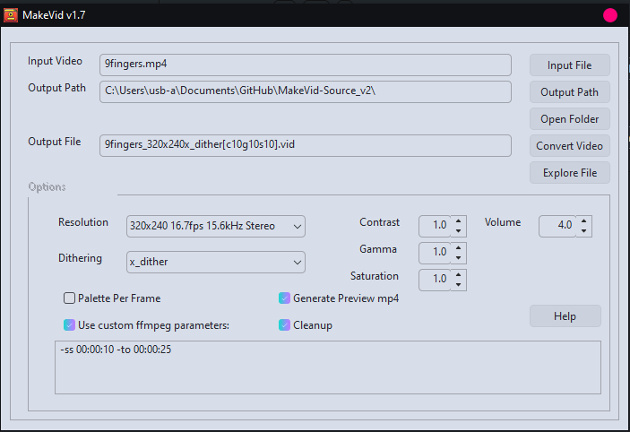

# MakeVid-Release
 Convert video files to ZX Next VID format
---
### MakeVid 1.7 by em00k 12/09/24
https://github.com/em00k/MakeVid-Release

If you enjoy this software please consider joining my Patreon
https://patreon.com/user?u=27217558 as it really helps!

Version history :

v1.7 15/09/24

   ADDED   :   If input video has no audio, dummy file used

v1.6 02/09/24

   ADDED   :   Registry usage for settings files and paths

   ADDED   :   Preview output file (reprocess exported files into an mp4 and play)

   ADDED   :   Space in filenames support! 

MakeVid is a tool that helps you convert videos into .VID files that can play
on the ZX Spectrum Next using Allen Albright's .playvid dot command. 



MakeVid uses ffmpeg to extract the frames and audio then stitches the frames 
into the correct format for playvid to use. You have the option of picking
a section of video to use, a custom palette for each frame - note this requires 
an external tool call IrfanView install and takes much longer to complete. 

## Quick start :

Drop any mp4/avi/mkv onto the Input Video text. Select the desired resolution from
the 3 options in the dropbox, if you want a preview at the end ensure "Generate
Preview mp4" is selected and this will generate a new mp4 that will play once the
conversion has completed to give you a taste of what the video will look like.

### Resolutions supported : 
```
    320x240 With palette 16.7fps 933 stereo samples @ 15.6kHz (frame size = 155) (layer 2)
    320x240 no palette 16.7fps 933 stereo samples @ 15.6kHz (frame size = 154) (layer 2)

    256x240 With palette 16.7 fps 1866 stereo samples @ 31.1kHz (frame size = 129) (layer 2)
    256x240 no palette 17fps 1866 stereo samples @ 31.1kHz (frame size = 128) (layer 2)

    256x192 With palette 25fps 933 mono samples @ 23.3kHz (frame size = 99) (layer 2)
    256x192 no palette 25fps 933 mono samples @ 23.3kHz (frame size = 98) (layer 2)
```
Use the "Dithering" dropbox to change the dither method used to convert the frames. You
can adjust the amplitude by adjust the Volume value, the default is 4.

MakeVid also lets you alter the contrast, gamme & saturation of the output file, the
default values are set to 1.0 - increments of 0.1 should be use for best effects. 

You can tell ffmpeg to only extract a section from the video if you enable "Use custom
ffmpeg parameters" this will enable the text box below which should have the default 
settings of :

```"-ss 00:00:00 -to 00:00:30"```

these values represent ```HH:MM:SS``` - be careful if you end up with a mistake here the video will 
not convert. 

Cleanup will clean up all the extracted videos and is a default option. This version 
has had the RAM drive option removed as you can now select an "Output Path" as a new
destination for the converted file and temporary files used. 

The button "Output Path" will let you select a new destination path, "Open Folder" will 
open the folder for the "Input Video" to browse, "Explore File" will open the folder
with the "Output File" in. 

### Conversion Process. 

- Extracts the audio at the required bit rate 
- Extracts the video as separate bitmap images, rotates or crops as required
- Creates a VID file by combining the extracted raw audio & raw bitmaps. 
- Optionally creates a preview mp4

So lets say we are converting a video to 256x192 25fps, 23Khz audio : 

Extract audio 23300Hz mono unsigned 8bit: 
```bash
ffmpeg -y -i "267.mp4"  -ac 1 -f u8 -ar 23300 -af "volume=3dB" "e:\audio.pcm"
```

Extract frames as BMP files 25fps 256x192 RGB8 palette: 
```bash
ffmpeg -y -i "267.mp4"  -vsync cfr -r 25 -vf "eq=contrast=1:gamma=1:saturation=1,vflip,scale=w=256:h=192:sws_dither=auto" -pix_fmt rgb8 "e:\ffmpeg0_%d.bmp"
```

The VID file is constructed in the following way : 

>0 = 320x240 With palette 16.7fps 933 stereo samples @ 15.6kHz (frame size = 155) (layer 2)

>1 = 320x240 no palette 16.7fps 933 stereo samples @ 15.6kHz (frame size = 154) (layer 2)

>2 = 256x240 With palette 16.7 fps 1866 stereo samples @ 31.1kHz (frame size = 129) (layer 2)

>3 = 256x240 no palette 17fps 1866 stereo samples @ 31.1kHz (frame size = 128) (layer 2)

>4 = 256x192 With palette 25fps 933 mono samples @ 23.3kHz (frame size = 99) (layer 2)

>5 = 256x192 no palette 25fps 933 mono samples @ 23.3kHz (frame size = 98) (layer 2)

So for 256x192 the VID frame goes:
>- 1kb audio buffer, with 933bytes samples of audio written
>- 49152 bytes of raw bitmap

320x244:
>- 2kb audio buffer, 933*2 samples written 
>- 76800 bytes of raw bitmap, rotated

256x240:
>- 4kb audio buffer, 1866*2 samples of audio written
>- 61440 raw bitmap.


*MakeVid requires ffmpeg to be located in the bin folder distributed with MakeVid.*

*MakeVid uses RegistryProc by mk-soft for saving & reading registry user preference data
and can be found in ```HKCU/Software/em00k/makevid```*

